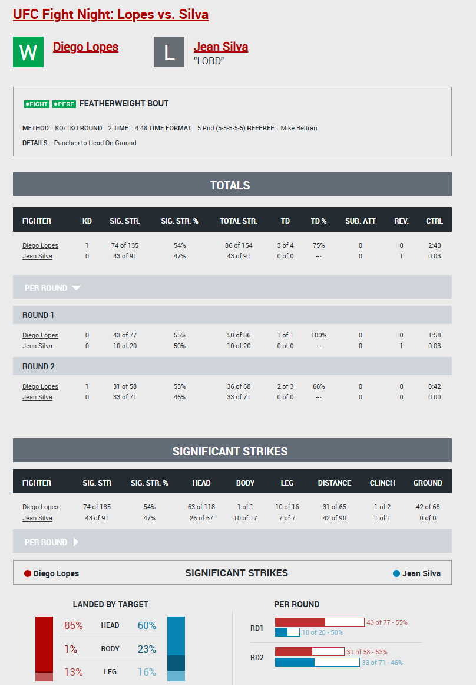
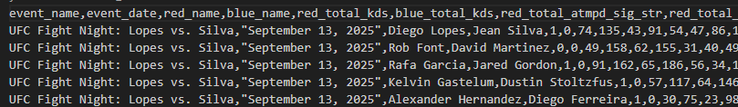
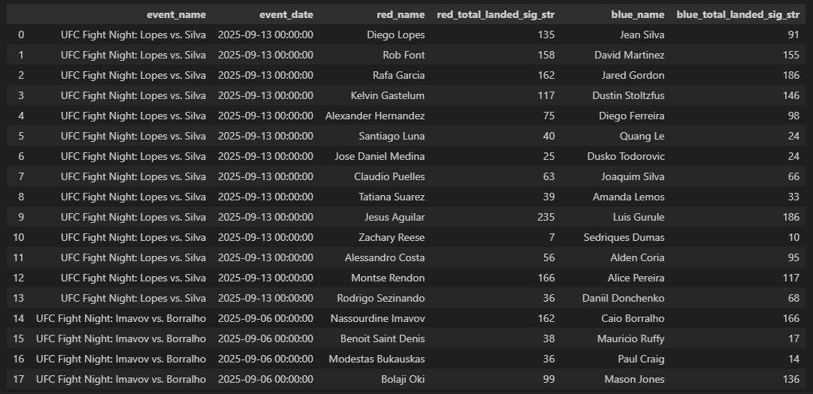

# Overview
This project generates a CSV file with the data that appears on the official UFC statistics website.


## Strategy
For this task, web scraping using Selenium was used.
## Data Processing
* The tables that appear on the website present some data in a composite format (for example, the "number of significant strikes" attribute is displayed in the format x of x_total). In these cases, the application separates the data into two (partial amount and total amount). This is to facilitate the processing of said data in the analyses that the user wishes to perform based on the generated dataset.
* Some data may not be available; in these cases, the data will appear in the format '---'. This does not indicate that the data has not been collected, but rather that a situation that allows it to be measured has not occurred. For example, regarding data related to takedown attempts, if the fighter has not attempted any takedowns, we will see '---' in the generated CSV.
## Quick Start
1. Dependencies installation
```
pip install -r requirements.txt
```
2. Script running
```
windows: python .\src\data_extraction\dataset.py
linux | mac: 
```
## Example
Original data source



.csv file output



Example of use with pandas



## Python
### Virtual environments
#### Creation
Virtual environments are created by executing the venv module:
```
python -m venv /path/to/new/virtual/environment
```

Once the command finishes run the activation script
```
.\venv\Scripts\activate
```

#### Dependencies
Install
```
pip install -r requirements.txt
```

Create/save deps using requirements file
```
pip freeze > requirements.txt
```